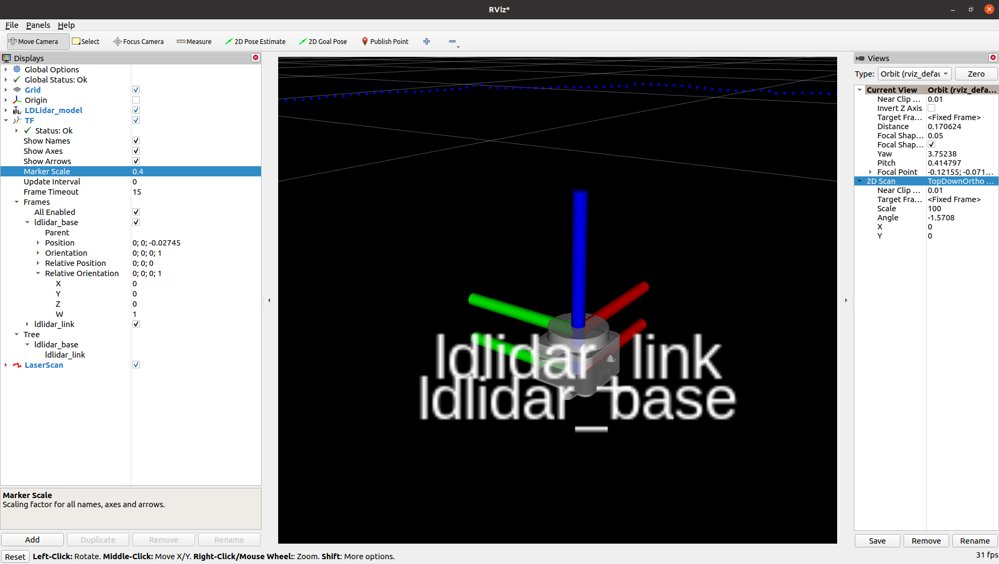
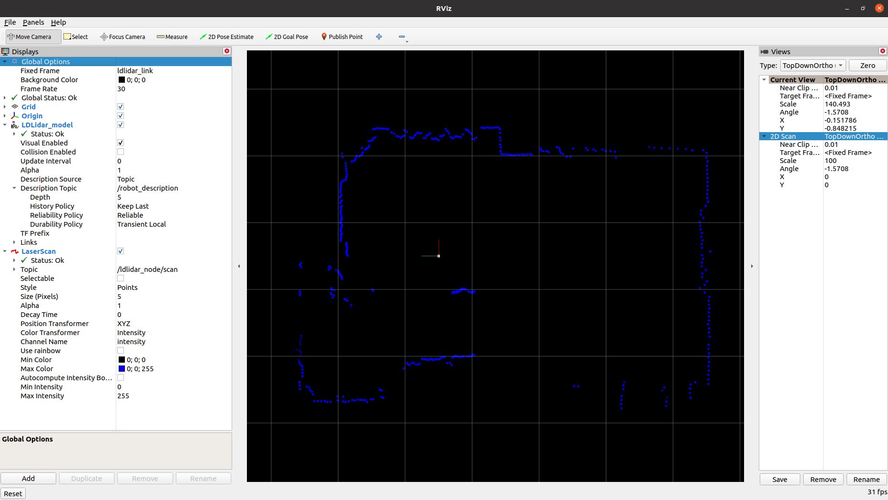

# LD Lidar ROS 2 Package

## ROS 2 package for LDRobot LD19 lidar - Based on Nav2 Lifecycle nodes

[Get the Lidar](#get-the-lidar) • [Install](#install-the-node) • [Start the Node](#start-the-node) • [Parameters](#parameters) • [RViz2](#display-scan-on-rviz2) • [Robot Integration](#integrate-the-node-in-your-robot)

This package is designed to work with the DToF 2D Lidar sensor [LD19](https://www.ldrobot.com/product/en/112) made by [LDRobot](https://www.ldrobot.com/en).

## Get the lidar

My lidar (LD19) comes from the [LDRobot kickstarter campaing](https://www.kickstarter.com/projects/ldrobot/ld-air-lidar-360-tof-sensor-for-all-robotic-applications) ended in 2021.

LDRobot then created also an [Indiegogo campaign](https://www.indiegogo.com/projects/ld-air-lidar-tof-sensor-for-robotic-applications--3#/) for the LD19.

LDRobot today distributes the Lidar through third-party resellers:

- Waveshare: [LD19](https://www.waveshare.com/wiki/DTOF_LIDAR_LD19)
- Innomaker: [LD06](https://www.inno-maker.com/product/lidar-ld06/)
- Other: [Search on Google](https://www.google.com/search?q=ld19+lidar&newwindow=1&sxsrf=ALiCzsb2xd4qTTA78N00mP9-PP5HY4axZw:1669710673586&source=lnms&tbm=shop&sa=X&ved=2ahUKEwjYns78_NL7AhVLVfEDHf2PDk8Q_AUoA3oECAIQBQ&cshid=1669710734415350&biw=1862&bih=882&dpr=1)

## Install the node

The node is designed to work with [ROS 2 Humble](https://docs.ros.org/en/humble/index.html)

Clone the repository in your ROS2 workspace:

    cd ~/ros2_ws/src/ #use your current ros2 workspace folder
    git clone https://github.com/rem421/SWAW-car-lidar.git

Add dependencies:

    sudo apt install libudev-dev

Install the udev rules

    cd ~/ros2_ws/src/SWAW-car-lidar/scripts/
    ./create_udev_rules.sh

Build the packages:

    cd ~/ros2_ws/
    rosdep install --from-paths src --ignore-src -r -y
    colcon build --symlink-install --cmake-args=-DCMAKE_BUILD_TYPE=Release

Update the environment variables:

    echo source $(pwd)/install/local_setup.bash >> ~/.bashrc
    source ~/.bashrc

## Start the node

### Launch file with YAML parameters

The default values of the [parameters of the node](#parameters) can be modified by editing the file [`ldlidar.yaml`](ldlidar_node/params/ldlidar.yaml).

Open a terminal console and enter the following command to start the node with customized parameters:

    ros2 launch ldlidar_node ldlidar_bringup.launch.py

The [`ldlidar_bringup.launch.py`](ldlidar_node/launch/ldlidar_bringup.launch.py) starts a ROS 2 Container, which loads the LDLidar Component as a plugin.

The [`ldlidar_bringup.launch.py`](ldlidar_node/launch/ldlidar_bringup.launch.py) script also starts a `robot_state_publisher` node that provides the static TF transform of the 
LDLidar [`ldlidar_base`->`ldlidar_link`], and provides the ldlidar description in the `/robot_description`.

### Lifecycle

The `ldlidar` node is based on the [`ROS2 lifecycle` architecture](https://design.ros2.org/articles/node_lifecycle.html), hence it starts in the `UNCONFIGURED` state.
To configure the node, load all the parameters, establish a connection, and activate the scan publisher, the lifecycle services must be called in sequence.

Open a new terminal console and enter the following command:

    ros2 lifecycle set /ldlidar_node configure

If the node is correctly configured and the connection is established, `Transitioning successful` is returned. If there are errors, `Transitioning failed` is returned. Check the node log for details on any connection issues.

The node is now in the `INACTIVE` state, enter the following command to activate:

    ros2 lifecycle set /ldlidar_node activate

The node is now activated and the `/ldlidar_node/scan` topic of type `sensor_msgs/msg/LaserScan` is available to be subscribed.

#### Launch file with YAML parameters and Lifecycle manager

Thanks to the [Nav2](https://navigation.ros.org/index.html) project, you can launch a [`lifecycle_manager`](https://navigation.ros.org/configuration/packages/configuring-lifecycle.html) node that handles the state transitions described above.
An example launch file, [`ldlidar_with_mgr.launch.py`](ldlidar_node/launch/ldlidar_with_mgr.launch.py), demonstrates how to start the `ldlidar_node` with parameters loaded from the 
`ldlidar.yaml` file. It also starts the `lifecycle_manager`, configured with the [`lifecycle_mgr.yaml`](ldlidar_node/config/lifecycle_mgr.yaml) file, to automatically manage the 
lifecycle transitions:

    ros2 launch ldlidar_node ldlidar_with_mgr.launch.py

The `ldlidar_with_mgr.launch.py` script automatically starts the `ldlidar_node` by including the `ldlidar_bringup.launch.py` launch file.

## Parameters

Following the list of node parameters:

- **`general.debug_mode`**: set to `true` to activate debug messages
- **`comm.serial_port`**: the serial port path
- **`comm.baudrate`**: the serial port baudrate
- **`comm.timeout_msec`**: the serial communication timeout in milliseconds
- **`lidar.model`**: Lidar model [LDLiDAR_LD19]
- **`lidar.rot_verse`**: The rotation verse. Use clockwise if the lidar is mounted upsidedown. [CW, CCW]
- **`lidar.units`**: distance measurement units [M, CM, MM]
- **`lidar.frame_id`**: TF frame name for the lidar
- **`lidar.bins`**: set to 0 for dinamic scan size according to rotation speed, set to a fixed value [e.g. 455] for compatibility with SLAM Toolbox
- **`lidar.range_min`**: minimum scan distance
- **`lidar.range_max`**: maximum scan distance
- **`lidar.enable_angle_crop`**: enable angle cropping
- **`lidar.angle_crop_min`**: minimum cropping angle
- **`lidar.angle_crop_max`**: maximum cropping angle

## Display scan on RViz2

The launch file `ldlidar_rviz2.launch.py` starts the `ldlidar_node` node, the `lifecycle_manager` node, and a preconfigured instance of RViz2 to display the 2D laser scan provided by the LDRobot sensors. This is an example to demonstrate how to correctly setup RViz2 to be used with the `ldlidar_node` node.

Open a terminal console and enter the following command:

    ros2 launch ldlidar_node ldlidar_rviz2.launch.py

## Integrate the LDLidar sensor in your robot

Follow these steps to integrate the LDLidar sensor into your robot configuration:

1. **Provide TF Transform**: Ensure there is a TF transform from `base_link` to `ldlidar_base`, positioned at the center of the lidar scanner base. The `ldlidar_base` -> `ldlidar_link` transform is provided by the `robot_state_publisher` started by the `ldlidar_bringup.launch.py` launch file.

2. **Modify Configuration**: Update the [`ldlidar.yaml`](ldlidar_node/config/ldlidar.yaml) file to match your robot's configuration.

3. **Include Launch File**: Add the [`ldlidar_bringup.launch.py`](ldlidar_node/launch/ldlidar_bringup.launch.py) to your robot's bringup launch file.

4. **Handle Lifecycle**: Properly manage the node's lifecycle. You can use the Nav2 `lifecycle_manager` by including it in your bringup launch file.

5. **Deploy and Test**: Deploy your configuration and test the system to ensure everything is working correctly.

Enjoy your fully integrated lidar system!
